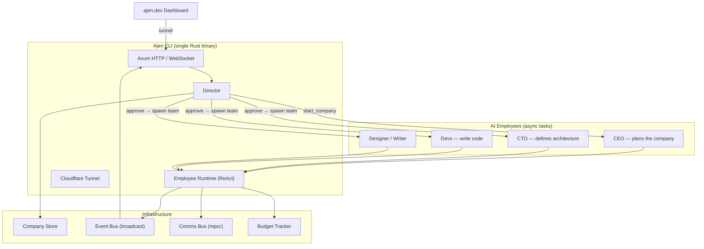

<div align="center">


# Ajen

**Ajna + Genesis — the third eye that generates entire companies from a single idea.**

Describe a startup. Watch AI employees build it. Ship in minutes, not months.

[](LICENSE)
[](https://www.rust-lang.org/)
[](CONTRIBUTING.md)

[Website](https://www.ajen.dev) · [Dashboard](https://www.ajen.dev) · [Contributing](CONTRIBUTING.md)

</div>

---

## What is Ajen?

Ajen is an open-source engine that spins up an entire AI-powered company from a single prompt. You describe the idea — Ajen creates a CEO, CTO, developers, designers, and content writers that plan, build, and deploy your product autonomously.

You sit on the board. The AI team does the rest.

> **Ajen** = **Ajna** (the third-eye chakra — vision, intuition, insight) + **Genesis** (origin, creation). See the idea. Bring it to life.

---

## Quick Start

```bash
# Clone & setup
git clone https://github.com/ajenhq/ajen.git && cd ajen
cp .env.example .env
# Add your ANTHROPIC_API_KEY to .env

# Run
cargo run --release
```

The CLI auto-installs `cloudflared` if needed, opens a tunnel, and prints everything you need:

```
  ┌─────────────────────────────────────────────────┐
  │  Ajen CLI v0.1.0                                │
  │                                                 │
  │  Secret:  ak_7f3a...b2c1                        │
  │  Local:   http://localhost:3000                  │
  │  Tunnel:  https://abc123.trycloudflare.com      │
  │                                                 │
  │  Connect: https://www.ajen.dev/cli_auth?url=... │
  │                                                 │
  │  Ready. Waiting for commands.                   │
  └─────────────────────────────────────────────────┘
```

Your browser opens the connect link automatically. The [ajen.dev](https://www.ajen.dev) dashboard connects to your local CLI through the tunnel — no port forwarding, no configuration.

---

## How It Works

```
  DESCRIBE            PLAN               APPROVE            BUILD
  ─────────          ──────             ─────────          ───────
  POST /companies    CEO analyzes       POST /approve      Director spawns
  { "description":   the idea and       to greenlight      team and executes
    "A marketplace   returns a plan     the plan           milestones
    for cameras" }   with milestones                       sequentially
```

### 1. Create a company

```bash
curl -X POST http://localhost:3000/api/companies \
  -H "Authorization: Bearer ak_7f3a...b2c1" \
  -H "Content-Type: application/json" \
  -d '{"description": "A vintage camera marketplace with auction support"}'
```

The CEO employee starts planning in the background. You get a `company_id` back immediately.

### 2. Check status

```bash
curl http://localhost:3000/api/companies/{id} \
  -H "Authorization: Bearer ak_7f3a...b2c1"
```

Returns the company status, plan (once ready), team members, task progress, and cost.

### 3. Approve the plan

```bash
curl -X POST http://localhost:3000/api/companies/{id}/approve \
  -H "Authorization: Bearer ak_7f3a...b2c1"
```

The Director spawns the team — CTO, developers, designer, content writer — and assigns tasks from each milestone. Employees work sequentially through the plan using the ReAct loop.

### 4. Watch it happen

```
wss://abc123.trycloudflare.com/api/companies/{id}/stream?token=ak_7f3a...b2c1
```

Every employee action, tool call, LLM response, and cost is streamed as typed events over WebSocket.

---

## API

All endpoints require `Authorization: Bearer <secret>` except `/health`.

| Method | Endpoint | Description |
|--------|----------|-------------|
| `GET` | `/health` | Liveness check (no auth) |
| `POST` | `/api/companies` | Create a company from a description |
| `GET` | `/api/companies` | List all companies |
| `GET` | `/api/companies/{id}` | Get company status, plan, and progress |
| `POST` | `/api/companies/{id}/approve` | Approve plan and start execution |
| `GET` | `/api/companies/{id}/stream` | WebSocket event stream (`?token=`) |

---

## CLI Flags

| Flag | Default | Description |
|---|---|---|
| `--port` | `3000` | Local server port |
| `--no-tunnel` | off | Disable Cloudflare tunnel |
| `--no-open` | off | Don't auto-open browser |
| `--workspace-dir` | `./workspaces` | Directory for generated projects |
| `--manifests-dir` | built-in | Custom employee manifests directory |

---

## Features

<table>
<tr>
<td width="33%" valign="top">

### Company Hierarchy
Board (you) → CEO → CTO / CMO / COO → Developers, designers, writers. The Director orchestrates the entire flow from idea to deployment.

</td>
<td width="33%" valign="top">

### Plug-and-Play Employees
Each employee is a YAML manifest + persona file. 14 built-in roles. Swap roles, add custom employees, share them with the community.

</td>
<td width="33%" valign="top">

### Multi-LLM Support
Claude, GPT, Gemini, or Ollama. Each employee can run on a different model — Sonnet for strategy, Haiku for execution.

</td>
</tr>
<tr>
<td width="33%" valign="top">

### Human-as-Board
The CEO generates a plan. You approve it before any work begins. You stay in control of what gets built.

</td>
<td width="33%" valign="top">

### Real-Time Events
Watch your company being built live at [ajen.dev](https://www.ajen.dev). Every tool call, LLM response, and cost is streamed over WebSocket.

</td>
<td width="33%" valign="top">

### Budget Controls
Per-employee and per-company cost tracking. Every LLM call records token usage and cost in cents.

</td>
</tr>
</table>

---

## Architecture



**Single binary** — Director, engine, API server, tunnel, and WebSocket all run in one Rust process on Tokio. The [ajen.dev](https://www.ajen.dev) dashboard connects to your local CLI via a Cloudflare tunnel — your code and API keys never leave your machine.

---

## Employee Manifest

Every employee is defined by a `manifest.yaml` and a `PERSONA.md`:

```yaml
# employee-manifests/ceo/manifest.yaml
apiVersion: ajen.dev/v1
kind: EmployeeManifest

metadata:
  id: "ceo"
  name: "Chief Executive Officer"
  version: "1.0.0"

spec:
  role: "ceo"
  tier: "executive"
  model:
    provider: "anthropic"
    model: "claude-sonnet-4-6"
  persona: "./PERSONA.md"
  tools:
    builtin:
      - "filesystem.read_file"
      - "filesystem.write_file"
      - "filesystem.list_directory"
  capabilities:
    canDelegateWork: true
    maxConcurrentTasks: 3
```

14 built-in roles: `ceo`, `cto`, `cmo`, `coo`, `fullstack_dev`, `frontend_dev`, `backend_dev`, `content_writer`, `designer`, `seo_specialist`, `devops`, `qa_engineer`, `social_media`, `data_analyst`. Roles are open strings — create any role you want.

---

## Tech Stack

| Layer | Technology |
|---|---|
| Language | Rust |
| Async Runtime | Tokio |
| HTTP Server | Axum |
| LLM Providers | Anthropic, OpenAI, Gemini, Ollama |
| Dashboard | [ajen.dev](https://www.ajen.dev) |
| Tunnel | Cloudflare Quick Tunnel (auto-installed) |
| Serialization | serde + serde_json + serde_yaml |
| IDs | UUID v4 |

---

## Project Structure

```
ajen/
  crates/
    ajen-core/          # Domain types, traits (EventBus, CompanyStore, LLMProvider, Tool)
    ajen-provider/      # LLM clients — Anthropic, OpenAI, Gemini, Ollama
    ajen-tools/         # Tool registry + filesystem tools (read, write, list)
    ajen-engine/        # Director, employee runtime, infra stores, manifests
    ajen-server/        # Axum HTTP + WebSocket + tunnel (the CLI binary)
  employee-manifests/   # 14 built-in employee definitions
    ceo/                #   manifest.yaml + PERSONA.md per role
    cto/
    fullstack-dev/
    ...
```

---

## Roadmap

- [x] Core Engine — ReAct loop, file tools, event bus
- [x] Multi-Provider — Anthropic, OpenAI, Gemini, Ollama
- [x] CLI with tunnel — secret auth, auto-install cloudflared, browser connect
- [x] Director — CEO planning, plan approval, team spawn, milestone execution
- [ ] Persistent Storage — SQLite-backed stores, data survives restarts
- [ ] Parallel Execution — concurrent tasks within milestones
- [ ] Container Isolation — sandboxed employee environments
- [ ] Plugin System — community employee manifests + custom tools
- [ ] ajen.dev Dashboard — real-time UI with Supabase auth

---

## Contributing

Ajen is in active development and contributions are welcome — bug fixes, new employee manifests, feature ideas.

1. Fork the repo
2. Create your branch (`git checkout -b feat/my-feature`)
3. Commit your changes
4. Open a pull request

See [open issues](https://github.com/ajenhq/ajen/issues) for things to work on.

---

## License

MIT — see [LICENSE](LICENSE) for details.

---

<div align="center">

Built with Rust, caffeine, and mass quantities of AI.

**[Star this repo](https://github.com/ajenhq/ajen)** if you think AI should build companies, not just code.

</div>
